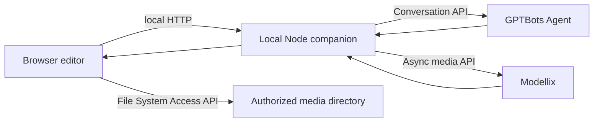

# GPTBots + Modellix Media Generation Design

**Date:** 2026-08-20

## Goal

Add secure, local-first AI image and video generation to the browser editor. GPTBots owns the conversation and decides when to propose a generation action. Modellix performs the media generation. Generated outputs are persisted into the user-authorized local media-library directory before they are considered complete.

## Scope

The first release supports:

- GPTBots multi-turn conversations through the public Conversation API.
- Text messages with referenced image assets from the media library.
- A single structured media-generation proposal per GPTBots assistant turn.
- Explicit user confirmation before any billable Modellix request.
- Text-to-image, image editing, text-to-video, and image-to-video.
- A fixed, curated Modellix adapter registry.
- Asynchronous task submission, polling, retry, download, and local-library ingestion.
- A settings surface for all authentication and provider configuration.

The first release does not support audio generation, video-to-video, automatic insertion into the timeline, multiple concurrent tool calls from one assistant response, Modellix webhooks, cloud deployment, or creation/modification of the user's GPTBots Agent.

## Architecture

The existing Vite browser application gains a local Node companion service. The browser never calls GPTBots or Modellix directly and never receives a complete API key.



The companion service owns authentication, provider requests, adapter validation, task persistence, polling, and remote-asset proxying. The browser owns visible conversation state, reference selection, user confirmations, directory permission, writing generated files, and refreshing the local media library.

## Security and Local Configuration

The top toolbar receives a Settings entry. Its panel exposes:

- GPTBots API Key.
- GPTBots data-center region: `sg`, `jp`, or `th`.
- GPTBots user ID.
- Modellix API Key.
- Enable/disable controls for each fixed Modellix adapter.
- Default image aspect ratio.
- Default video duration and resolution.

Secrets are sent only to the local companion service. On the current macOS target, the service stores them in `~/Library/Application Support/Lumina AI Video Editor/settings.json` with owner-only file permissions. Generation-job recovery data lives beside it in `generation-jobs.json`. Neither file is inside the repository. The settings API returns only configuration status and the last four characters of each key, never the full value. Request logs, error objects, and diagnostics redact authorization headers and key-like strings.

The settings panel provides independent connection tests for GPTBots and Modellix. GPTBots uses `GET /v1/api-key/verify`; Modellix uses the non-generation `GET /api/v1/media/files?limit=1&offset=0` request. Neither test starts a billable generation task.

## GPTBots Conversation Flow

The companion uses the official regional GPTBots host:

- `POST /v1/conversation` to create a conversation.
- `POST /v2/conversation/message` in blocking mode for the first implementation.

A GPTBots `conversation_id` is associated with the local editor project and reused for later turns. If it becomes invalid, the UI offers to start a new conversation rather than silently losing context.

Each user message can include zero or more explicitly referenced media-library images. The browser reads authorized local files and sends them to the companion. The companion encodes the references in the GPTBots V2 multimodal message format using Base64 content, format, and display name. Only assets explicitly referenced in the current turn are eligible for a generation action from that response.

The user owns and configures the GPTBots Agent. This project does not create or publish a `.bot` or `.flow` file.

## Structured Media Tool Protocol

GPTBots may append one fenced `modellix_tool` block to an otherwise normal assistant reply:

````text
I will animate the referenced image.

```modellix_tool
{
  "action": "generate_media",
  "adapter_id": "seedance-2.0-i2v",
  "prompt": "Slow camera push-in while the subject turns toward the city lights",
  "reference_asset_ids": ["asset-123"],
  "parameters": {
    "duration": 5,
    "resolution": "1080p",
    "aspect_ratio": "16:9"
  }
}
```
````

The parser accepts exactly one block per assistant turn. Normal assistant text is rendered; the fenced tool payload is hidden and replaced by a generation proposal card.

The command schema is:

```ts
interface MediaGenerationProposal {
  action: 'generate_media';
  adapter_id: string;
  prompt: string;
  reference_asset_ids: string[];
  parameters: Record<string, string | number | boolean>;
}
```

Before displaying a confirmable proposal, the companion validates:

- The payload is valid JSON with no unknown top-level fields.
- `action` is exactly `generate_media`.
- The adapter exists and is enabled.
- The prompt is non-empty and within the selected adapter's limit.
- Every referenced asset exists, is online, is an image, and was explicitly attached to the triggering user turn.
- The number and type of references match adapter capabilities.
- Every parameter is declared by the adapter and falls within its enum/range constraints.

Invalid proposals never reach Modellix. The assistant text remains visible with a concise local validation error.

## Fixed Modellix Adapter Registry

Adapters normalize provider-specific endpoints, input names, supported references, defaults, constraints, and result media type. Exact API paths and field names must be verified against each official Modellix model page while implementing the registry; no endpoint is inferred from display names.

Initial adapter set:

| Family | Adapter | Capability |
|---|---|---|
| Seedance | Seedance 1.5 Pro T2V | text-to-video |
| Seedance | Seedance 2.0 I2V | image-to-video |
| Kling | Kling Image O1 | text/reference-to-image |
| Kling | Kling V3 T2V | text-to-video |
| Kling | Kling V3 I2V | image-to-video |
| MiniMax | Hailuo 2.3 T2V | text-to-video |
| MiniMax | Hailuo 2.3 Fast I2V | image-to-video |
| Wan | Wan 2.7 Image Pro | text-to-image |
| Wan | Wan 2.7 Image Pro Edit | image editing |
| Wan | Wan 3.0 T2V | text-to-video |
| Wan | Wan 3.0 I2V | image-to-video |
| Gemini / Google | Nano Banana 2 | text-to-image |
| Gemini / Google | Nano Banana 2 Edit | image editing |
| Gemini / Google | Veo 3.1 T2V | text-to-video |
| Gemini / Google | Veo 3.1 I2V | image-to-video |

Although the earlier estimate was thirteen adapters, the confirmed family matrix contains fifteen distinct capability adapters because Kling and Google each require separate image and video variants. The UI groups adapters by output type and capability rather than displaying one undifferentiated list. An adapter is offered only when the current reference selection satisfies its input requirements.

Each registry entry implements one common contract:

```ts
interface ModellixAdapter {
  id: string;
  label: string;
  family: 'seedance' | 'kling' | 'minimax' | 'wan' | 'google';
  capability: 'text-to-image' | 'image-to-image' | 'text-to-video' | 'image-to-video';
  outputKind: 'image' | 'video';
  endpoint: string;
  referenceRules: { min: number; max: number };
  parameterSchema: AdapterParameter[];
  buildRequest(input: ValidatedGenerationInput): Record<string, unknown>;
}
```

The registry is versioned in source control. Adding a model means adding one adapter and its contract tests; it never changes the generic task engine.

## Confirmation and Generation Flow

The proposal card shows adapter, output type, prompt, references, duration/resolution or image size, and a warning that generation may consume Modellix balance. No request is submitted until the user clicks **Start generation**.

After confirmation:

1. The companion revalidates the proposal and current settings.
2. Referenced files are uploaded through `POST /api/v1/media/files` when the adapter requires public URLs. When a model accepts a Base64 data URL and the validated size is safe, the adapter may use it directly.
3. The adapter builds the provider-specific body and submits its Modellix async endpoint with Bearer authentication.
4. The companion persists the returned `task_id`, adapter ID, project/conversation linkage, prompt, reference metadata, and current status.
5. The companion polls `GET /api/v1/tasks/{task_id}` with bounded exponential backoff.
6. On success, it validates the returned resource type and gives the browser a same-origin download stream.
7. The browser writes the resource into the authorized local media-library directory with a collision-safe filename.
8. Only after the write completes does the task become `completed`; the media library rescans and the new flat tile appears.

Generated media is never inserted into the timeline automatically. The user keeps the existing explicit drag-to-timeline workflow.

## Task State and Recovery

Generation jobs use these states:

- `proposal`: parsed and validated, awaiting confirmation.
- `submitting`: uploading references or creating the Modellix task.
- `pending`: accepted by Modellix and waiting to run.
- `processing`: Modellix reports active generation.
- `downloading`: remote output exists and is being copied locally.
- `awaiting_directory_permission`: output exists but the browser cannot write it.
- `completed`: the output has been written and indexed locally.
- `failed`: terminal error with a safe user-facing reason.
- `canceled`: canceled locally or reported canceled by Modellix.

Nonterminal jobs are persisted by the companion. After a page refresh, the browser reloads them and polling resumes without resubmitting the billable request. Repeated confirmation attempts use an idempotency key so one proposal cannot create duplicate tasks.

## Error Handling

- GPTBots `401`: mark GPTBots disconnected and open the settings repair action.
- Modellix `401`: mark Modellix disconnected and open the settings repair action.
- Modellix `402`: report insufficient balance; do not retry.
- `400` and unsupported adapter input: report the validated field error; do not retry.
- `404`: distinguish missing task/model from a missing local asset; do not retry blindly.
- `429`: respect `X-RateLimit-Reset` when present, otherwise back off.
- `500`/`503` and transient network failures: retry at 1, 2, and 4 seconds, then fail with a manual retry action.
- GPTBots timeout or malformed tool payload: never call Modellix.
- Modellix success with no usable resource: fail safely and retain the task ID for diagnostics.
- Directory permission loss: retain the remote result card with **Reauthorize directory** and **Download file** actions.

Modellix resources are retained for approximately seven days. Any successful remote result that has not been written locally displays an expiry-risk warning.

## User Interface Changes

Only the affected surfaces change:

- Top toolbar: Settings button and provider connection indicator.
- Assistant composer: reference-asset picker and removable reference chips.
- Assistant conversation: streamed/blocked reply state, generation proposal card, progress card, result preview, and retry/reauthorize actions.
- Model controls: GPTBots remains the conversation provider; the generation selector shows only enabled fixed adapters compatible with current references.
- Asset library: generated files appear through the existing directory rescan, with no special version-stack behavior.

The existing Apple-style interaction rules apply to the new sheet, chips, confirmation card, progress transitions, interruption, reduced motion, and focus restoration. No unrelated UI is refactored.

## Local Companion API Boundaries

The browser communicates only with these local same-origin endpoints:

- `GET/PUT /api/settings` — masked status and updates.
- `POST /api/settings/test/gptbots` — non-billable GPTBots authentication check.
- `POST /api/settings/test/modellix` — non-billable Modellix authentication check.
- `GET /api/adapters` — enabled adapter metadata and parameter schemas.
- `POST /api/conversations` — create/recover local and GPTBots conversation linkage.
- `POST /api/conversations/:id/messages` — send text and explicit references to GPTBots; parse a proposal.
- `POST /api/generation-jobs` — confirm and create one idempotent generation job.
- `GET /api/generation-jobs` and `GET /api/generation-jobs/:id` — recover and observe jobs.
- `GET /api/generation-jobs/:id/output` — same-origin output stream for local persistence.

These routes, trust boundaries, and responsibilities are the implementation contract.

## Testing Strategy

All feature work follows test-first development.

Unit tests cover:

- Strict `modellix_tool` parsing and rejection of malformed/multiple commands.
- Adapter input validation and provider-specific body mapping for all fifteen adapters.
- Reference-asset authorization and current-turn scoping.
- Secret masking and redaction.
- Retry classification and backoff.
- Task-state transitions and idempotency.

Service integration tests use fake HTTP servers for GPTBots and Modellix to cover conversation creation, multimodal messages, async task polling, result retrieval, authentication failures, rate limits, and restart recovery. Tests never call billable production endpoints.

React tests cover settings, reference chips, confirmation gating, progress recovery, error repair actions, and media-library refresh after a successful local write. Existing timeline/preview tests remain green.

Manual acceptance uses user-provided keys only after implementation and explicit authorization. It verifies one image generation and one referenced image-to-video generation, then confirms that both files are present in the selected local directory and draggable onto compatible timeline tracks.

## Acceptance Criteria

- Complete API keys are absent from browser state, browser storage, rendered HTML, and logs.
- GPTBots conversations persist across turns and receive explicitly referenced images.
- Normal GPTBots replies never trigger Modellix.
- A valid tool instruction always requires user confirmation before billing.
- Disabled, unknown, or incompatible adapters cannot be submitted.
- Refreshing the page does not duplicate an in-progress task.
- Successful image and video outputs are written into the chosen local directory and appear in the flat media grid.
- Provider failures produce actionable, provider-specific messages without leaking secrets.
- Full automated tests and production build pass.

## Authoritative References

- Modellix REST API: https://docs.modellix.ai/ways-to-use/api
- Modellix model/pricing index: https://docs.modellix.ai/get-started/pricing
- GPTBots Create Conversation: https://www.gptbots.ai/zh_CN/docs/api-reference/conversation-api/create-conversation
- GPTBots Send Message V2: https://www.gptbots.ai/zh_CN/docs/api-reference/conversation-api/send-message-v2
